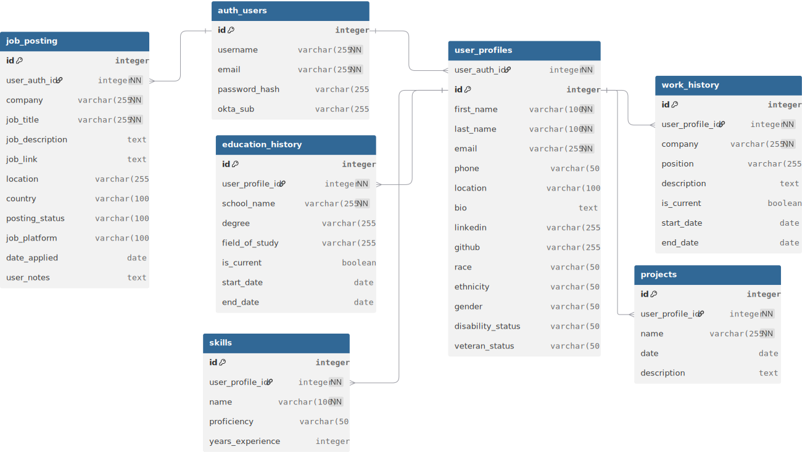

## Database Overview

This section outlines the database schema, the migration and upgrade process, and the infrastructure setup across Docker containers and cloud deployment.

---

### 1. Schema Overview

The application uses a PostgreSQL database to store user data, job information, and resume documents. A high-level schema diagram is provided below:





Tables include:

* `user_profiles`
* `education_history`
* `work_history`
* `job_postings`
* `auth_users`
* `resume_documents`

Tables are related through foreign keys to ensure data consistency across profile and application data.

---

### 2. Migration and Upgrade Process

The project uses `Flask-Migrate`, which integrates SQLAlchemy with Alembic to manage database schema changes. All migration history is tracked in the `migrations/` directory.

Common commands:

```bash
flask db init       # Run once to initialize migration directory
flask db migrate -m "Add column to job_postings"
flask db upgrade    # Apply latest migration to database
flask db downgrade  # Revert the most recent migration
```

Migrations are version-controlled and should be included in pull requests when schema changes are made.

---

### 3. Containerized Deployment

The backend, frontend, and database each run in separate Docker containers:

* **Backend (Flask)** connects to the database using environment-configured credentials.
* **Frontend (React)** interacts with the backend through exposed API endpoints.
* **Database (PostgreSQL)** is hosted in a dedicated Docker container on a cloud VM.

---

### 4. Cloud Database Hosting

The PostgreSQL container is deployed on an AWS EC2 instance, which uses an Elastic IP to allow consistent access from backend services.

Key points:

* The database runs inside a container on EC2, separate from the application backend.
* An Elastic IP ensures the service is reachable even if the instance is restarted.
* Data persistence is achieved using named volumes or bind mounts.
* AWS Security Groups are configured to allow access only from authorized IP addresses, typically the backend server or local development environments.

---